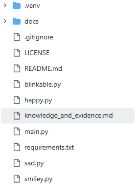
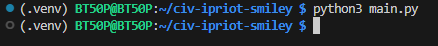
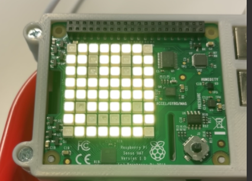
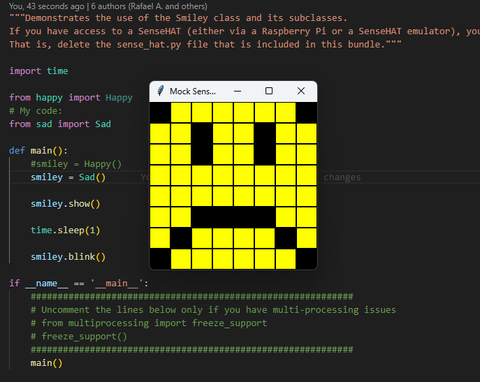
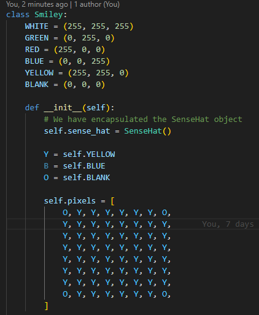
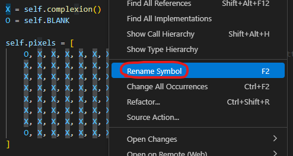
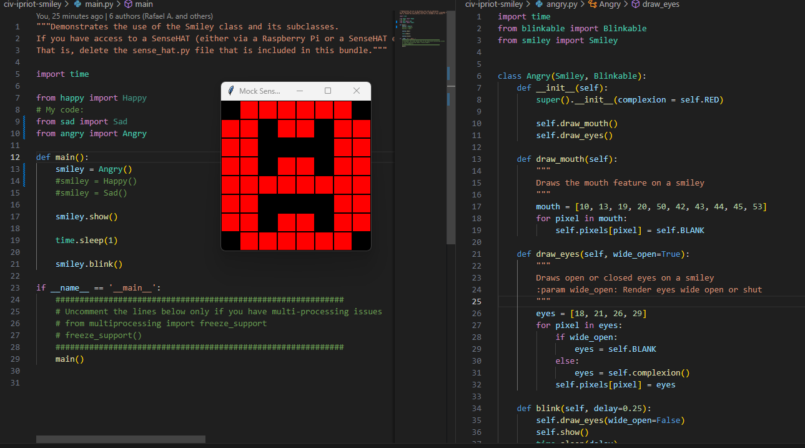

<style>

body {
    counter-reset: h2counter;
}

/* H1 - No numbering */
h1 {
    /* No counter reset or increment */
}

/* H2 - Level 1 numbering */
h2 {
    counter-reset: h3counter;
}

h2::before {
    counter-increment: h2counter;
    content: counter(h2counter) ". ";
}

/* H3 - Level 2 numbering */
h3 {
    counter-reset: h4counter;
}

h3::before {
    counter-increment: h3counter;
    content: counter(h2counter) "." counter(h3counter) " ";
}

/* H4 - Level 3 numbering (optional) */
h4 {
    counter-reset: h5counter;
}

h4::before {
    counter-increment: h4counter;
    content: counter(h2counter) "." counter(h3counter) "." counter(h4counter) " ";
}

</style>

# Evidence and Knowledge

This document includes instructions and knowledge questions that must be completed to receive a *Competent* grade on this portfolio task.

## Required evidence

### Answer all questions in this document

- Each answer should be complete, well-articulated, and within the specified word count limits (if added) for each question.
- Please make sure **all** external sources are properly cited.
- You must **use your own words**. Please include your full chat transcripts if you use generative AI in any way.
- Generative AI hallucinates, is not an authoritative source

### Make all the required modifications to the code

- Please follow the instructions in this document to make the changes needed to the code.

- When requested to upload evidence, upload all screenshots to `screenshots/` and embed them in this document. For example:

```markdown

```

- You must upload the code into your GitHub repository.
- While you can use a branch, your code should be in main when you submit.
- Upload a zip of this repository to Blackboard when you are ready to submit.
- You will be notified of your result via Blackboard
- However, if using GitHub classrooms, you may also receive additional feedback on GitHub directly

### Optional: Use of Raspberry Pi and SenseHat

Raspberry Pi or SenseHat is **optional** for this activity. You can use the included `sense_hat.py` file to simulate the SenseHat on your computer.

If you use a Pi, please **delete** the `sense_hat.py` file.

### Accessible version of the code

This project relies on visual patterns that appear on an LED matrix. If you have any accessibility requirements, you can use the `udl/accessible` branch to complete the project. This branch provides an accessible code version that uses text-based patterns instead of visual ones.

Please discuss this with your lecturer before using that branch.

## Specific Tasks & Questions

Address the following tasks and questions based on the code provided in this repository.

### Set up the project locally

1. Fork this repository (if not using GitHub Classrooms)
2. Clone your repository locally
3. Run the project locally by executing the `main.py` file
4. Evidence this by providing screenshots of the project directory structure and the output of the `main.py` file





If you are running on a Raspberry Pi, you can use the following command to run the project and then screenshot the result:

```bash
ls
python3 main.py
```

### Fundamental code comprehension

 Answer each of the following questions **as they relate to that code** supplied by in this repository (ignore `sense_hat.py`):

1. Examine the code for the `smiley.py` file and provide  an example of a variable of each of the following types and their corresponding values (`_` should be replaced with the appropriate values):

   | Type                    | name             | value            |
   | ----------              | ---------------- | ---------------- |
   | built-in primitive type | dimmed           |  True            | 
   | built-in composite type | WHITE            |  (255, 255, 255) |
   | user-defined type       | self.sense_hat   |  SenseHat()      |

2. Fill in (`_`) the following table based on the code in `smiley.py`:

   | Object                   | Type                    |
   | ------------             | ----------------------- |
   | self.pixels              | list                    |
   | A member of self.pixels  | tuple                   |
   | self                     | The smiley class        |

3. Examine the code for `smiley.py`, `sad.py`, and `happy.py`. Give an example of each of the following control structures using an example from **each** of these files. Include the first line and the line range:

   | Control Flow | File       | First line  | Line range  |
   | ------------ | ---------- | ----------- | ----------- |
   |  sequence    | smiley.py  | 11          | 26 (15 lines)|
   |  selection   | sad.py     | 26          | 30 (4 lines)|
   |  iteration   | happy.py   | 30          | 31 (2 lines)|

4. Though everything in Python is an object, it is sometimes said to have four "primitive" types. Examining the three files `smiley.py`, `sad.py`, and `happy.py`, identify which of the following types are used in any of these files, and give an example of each (use an example from the code, if applicable, otherwise provide an example of your own):

   | Type                    | Used? | Example |
   | ----------------------- | ----- | --------|
   | int                     | Yes - happy.py & sad.py | pixel is an int, used to determine indivudal pixels, whereas "pixels" is a list |
   | float                   | Yes - happy.py     | delay is a float, set to 0.25          |
   | str                     | No     | A str object is used to show text, which isn't present in this code. Unless you count the doc strings, then yes, it does appear!         |
   | bool                    | Yes - smiley.py     | dimmed is a bool, allowing True of False |

5. Examining `smiley.py`, provide an example of a class variable and an instance variable (attribute). Explain **why** one is defined as a class variable and the other as an instance variable.

> Class variable: The colours (WHITE, GREEN, RED, YELLOW, BLANK) - These are variables defined at the class level and shared across all instances of the class. They are used throughout the class. If one of these values is changed at the class level, it will affect every instance of the class.
>
> Instance variable: self.pixels - This is set when a new instance of Smiley is created. Each instance gets its own separate copy of self.pixels. If one instance modifies self.pixels, it won't affect any other instances.

6. Examine `happy.py`, and identify the constructor (initializer) for the `Happy` class:
   1. What is the purpose of a constructor (in general) and this one (in particular)?

   > In General: The intialiser runs first when the object is created. It's designed to set the state of the object and assign default values to attributes, if any.
   >
   > In Particular: The Happy class inherits from Smiley and Blinkable, and its constructor begins by calling "super().__init__()" to initialise the parent classes. After that, it customises the object by drawing the mouth and eyes using "self.draw_mouth()" and "self.draw_eyes()".

   2. What statement(s) does it execute (consider the `super` call), and what is the result?

   > First it calls Smiley and Blinkable using the 'super' called. This creates the face and initialises the abstract blink method. Then it draws the eyes and mouth using draw_mouth() and draw_eyes().
   >
   > In order, this creates a flat yellow circle, then turns off the LEDs to make up the eyes and mouth


### Code style

1. What code style is used in the code? Is it likely to be the same as the code style used in the SenseHat? Give to reasons as to why/why not:
   
> snake_case
>
> This is a PEP8 standard and makes code easier to read. Using the PEP8 standard across different modules makes it easier to read and understand.

2. List three aspects of this convention you see applied in the code.

>1. draw_mouth()
>2. draw_eyes()
>3. wide_open=True

3. Give two examples of organizational documentation in the code.

>1. The docstrings
> Example (in happy.py): 
>      """
>      Renders a mouth by blanking the pixels that form that object.
>      """
>2. Comments
> Example (in smiley.py):
>     "# We have encapsulated the SenseHat object"

### Identifying and understanding classes

> Note: Ignore the `sense_hat.py` file when answering the questions below

1. List all the classes you identified in the project. Indicate which classes are base classes and which are subclasses. For subclasses, identify all direct base classes.
  
  Use the following table for your answers:

| Class Name | Super or Sub? | Direct parent(s) |
| ---------- | ------------- | ---------------- |
| Sad        | Sub               | Smiley    |
|   Happy      |   Sub         |      Smiley & Blinkable         |
| Blinkable    | Sub           | Happy    |
|   Smiley      |   Super         |      No Parents         |


2. Explain the concept of abstraction, giving an example from the project (note "implementing an ABC" is **not** in itself an example of abstraction). (Max 150 words)

> Abstraction hides complex implementation details while exposing only what’s necessary to use a feature. It helps developers control how their code is used by defining a clear interface while keeping the internal logic hidden.
>
> For example: blinkable.py defines an abstract class by using the Python ABC module. It defines a method structure that all subclasses must follow. Any class that inherits from blinkable must implement the blink() method, without needing to understand how the rest of the system works

3. What is the name of the process of deriving from base classes? What is its purpose in this project? (Max 150 words)

> Inheritance.
> The purpose in this project is to ensure all classes that require certain behaviours, like blinking, inherit the necessary code. This avoids repetition and keeps each class consistent.

### Compare and contrast classes

Compare and contrast the classes Happy and Sad.

1. What is the key difference between the two classes?
   > The Sad class does not inherit from Blinkable, meaning it is unable to blink.
   
2. What are the key similarities?
   > They both inherit from Smiley.
   > They both draw the mouth and eyes similarly, just positioned differently to show happy or sad expressions.

3. What difference stands out the most to you and why?
   > The blink method in Happy.py. It inherits from Blinkable, but due to abstraction, the method still needs to be defined within Happy.

4. How does this difference affect the functionality of these classes
   > Sad is unable to blink due to the lack of inheritance from blinkable
   

### Where is the Sense(Hat) in the code?

1. Which class(es) utilize the functionality of the SenseHat?
   > 1. Smiley
   > 2. Sad (via inheritance from Smiley)
   > 3. Happy (via inheritance from Smiley)
2. Which of these classes directly interact with the SenseHat functionalities?
   > Smiley, with self.sense_hat = SenseHat() in the initializer
   >
3. Discuss the hiding of the SenseHAT in terms of encapsulation (100-200 Words)
   > Encapsulating the SenseHAT within the Smiley class both hides the SenseHAT object from the rest of the project and restricts its usage to the Smiley class only. With this setup, the "show" and "dim_display" methods inside the Smiley class interact with the SenseHAT object, but other classes such as "Sad" or "Happy" cannot access or modify it directly. This use of encapsulation helps keep control in one place and easier to manage.
   >

### Sad Smileys Can’t Blink (Or Can They?)

Unlike the `Happy` smiley, the current implementation of the `Sad` smiley does not possess the ability to blink. Let's first explore how blinking has been implemented in the Happy Smiley by examining the blink() method, which takes one argument that determines the duration of the blink.

**Understanding Blink Mechanism:**

1. Does the code's author believe that every `Smiley` should be able to blink? Explain.

> No, the code author only belives the "Happy" smiley can blink, as the Blinkable object is only accessible from the "Happy" smiley.
>

2. For those smileys that blink, does the author expect them to blink in the same way? Explain.

> No, the blink method is being set within the "Happy" class. This is due to the blinkable object being abstract and needing to be specified within the "Happy" class.
>

3. Referring to the implementation of blink in the Happy and Sad Smiley classes, give a brief explanation of what polymorphism is.

> Polymorphism allows different classes to define their own versions of the same method. In this instance, the "Happy" and "Sad" classes can each implement a different version of the blink method, even though they share the same method name. This means the blink behaviour is specific to the class it is defined in, making it unique to either "Happy" or "Sad".
>

4. How is inheritance used in the blink method, and why is it important for polymorphism?

> Inheritance in the blink method allows the class to use shared features like "show()" and pixel data from the "Smiley" parent class. It also enforces structure through the Blinkable abstract base class in "Happy". This is important for polymorphism, as it lets each class define its own version of blink.
>
1. **Implement Blink in Sad Class:**

   - Create a new method called `blink` within the Sad class. Ensure you use the same method signature as in the Happy class:

   ```python
   def blink(self, delay=0.25):
      self.draw_eyes(wide_open=False)
      self.show()
      time.sleep(delay)
      self.draw_eyes(wide_open=True)
      self.show()
   ```

2. **Code Implementation:** Implement the code that allows the Sad smiley to blink. Use the implementation from the Happy Smiley as a reference. Ensure your new method functions similarly by controlling the blink duration through the `delay` argument.

3. **Testing the Implementation:**

- Test the new blink functionality on your Raspberry Pi or within the Python classes provided. You might need to adjust the `main.py` script to incorporate Sad Smiley's new blinking capability.

Include a screenshot of the sad smiley or the modified `main.py`:



- Observe and document the Sad smiley as it blinks its eyes. Describe any adjustments or issues encountered during implementation.

  > I had to adjust the sad file to include "import time" and "from blinkable import Blinkable".
  > After I imported time and blinkable, I then adjusted the sad class to: "class Sad(Smiley, Blinkable):"
  > Then, I implemented the sad blink method (see code above, in 2.7.1)
  > Running the main.py after these changes, I found the smiley appeared but couldn't blink. I then had to adjust the main.py file.
  > In main.py, I had to change: "from happy import Happy" TO "from sad import Sad" as well as: "smiley = Happy()" TO "smiley = Sad()"

  ### If It Walks Like a Duck…

  Previously, you implemented the blink functionality for the Sad smiley without utilizing the class `Blinkable`. Assuming you did not use `Blinkable` (even if you actually did), consider how the Sad smiley could blink similarly to the Happy smiley without this specific class.

  1. **Class Type Analysis:** What kind of class is `Blinkable`? Inspect its superclass for clues about its classification.

     > Blinkable is an abstract class

  2. **Class Implementation:** `Blinkable` is a class intended to be implemented by other classes. What generic term describes this kind of class, which is designed for implementation by others? **Clue**: Notice the lack of any concrete implementation and the naming convention.

  > An interface

  3. **OO Principle Identification:** Regarding your answer to question (2), which Object-Oriented (OO) principle does this represent? Choose from the following and justify your answer in 1-2 sentences: Abstraction, Polymorphism, Inheritance, Encapsulation.

  > Polymorphism - it's designed to be used multiple times but unique to the class it's being called from.

  4. **Implementation Flexibility:** Explain why you could grant the Sad Smiley a blinking feature similar to the Happy Smiley's implementation, even without directly using `Blinkable`.

  > You could give the Sad Smiley a blink method without using Blinkable because Python doesn’t require classes to follow an interface. If the class has the right methods, like blink(), Python treats it as if it’s blinkable.

  5. **Concept and Language Specificity:** In relation to your response to question (4), what is this capability known as, and why is it feasible in Python and many other dynamically typed languages but not in most statically typed programming languages like C#? **Clue** This concept is hinted at in the title of this section.

  > Duck typing

  ***

  ## Refactoring

  ### Does a Smiley Have to Be Yellow?

  While our current implementation predominantly features yellow smileys, emotional expressions like sickness or anger typically utilize colors like green, red, or orange. We'll explore the feasibility of integrating these colors into our smileys.

  1. **Defined Colors and Their Location:**

     1. Which colors are defined and in which class(s)?
        > White, Green, Red and yellow - all defined within Smiley
     2. What type of variables hold these colors? Are the values expected to change during the program's execution? Explain your answer.
        > A tuple (containing 3 integers) holds their values. They are in capitals meaning they are constants, so they should not be changed. In this project, no code is directly editing them.
     3. Add the color blue to the appropriate class using the appropriate format and values.
         > 

  2. **Usage of Color Variables:**

     1. In which classes are the color variables used?
        > Smiley, Happy and Sad. Smiley sets the colour of the overall face, where Happy and Sad set the colour of the eyes when they close.

  3. **Simple Method to Change Colors:**
  4. What is the easiest way you can think to change the smileys to green? Easiest, not necessarily the best!
      > Simply change the tuple for YELLOW to: (0,255,0) (although this is horrible code, and I'd much prefer to do the way below)
      >
     > Create a for loop to read the pixels tuple and set them to green, eg:
     > ```python 
     > for i in range(len(self.pixels)):
      > if self.pixels[i] == Y:
      >  self.pixels[i] = G
      ```

  Here's a revised version of the "Flexible Colors – Step 1" section for the smiley project, incorporating your specifications for formatting and content updates:

  ### Flexible Colors – Step 1

  Changing the color of the smileys once is straightforward, but it isn't very flexible. To facilitate various colors for smileys, it is advisable not to hardcode values in any class. This approach was identified earlier as a necessary change. Let's start by removing the built-in assumptions about color in our classes.

  1. **Add a method called `complexion` to the `Smiley` class:** Implement this instance method to return `self.YELLOW`. Using the term "complexion" instead of "color" provides a more abstract terminology that focuses on the meaning rather than implementation.

  2. **Refactor subclasses to use the `complexion` method:** Modify any subclass that directly accesses the color variable to instead utilize the new `complexion` method. This ensures that color handling is centralized and can be easily modified in the future.

  3. **Determine the applicable Object-Oriented principle:** Consider whether Abstraction, Polymorphism, Inheritance, or Encapsulation best applies to the modifications made in this step.

  4. **Verify the implementation:** Ensure that the modifications function as expected. The smileys should still display in yellow, confirming that the new method correctly replaces the direct color references.

  This step is crucial for setting up a more flexible system for color management in the smiley display logic, allowing for easy adjustments and extensions in the future.

  ### Flexible Colors – Step 2

  Having removed the hardcoded color values, we now enhance the base class to support dynamic color assignments more effectively.

  1. **Modify the `__init__()` method in the `Smiley` class:** Introduce a default argument named `complexion` and assign `YELLOW` as its default value. This allows the instantiation of smileys with customizable colors.

  2. **Introduce a new instance variable:** Create a variable called `my_complexion` and assign the `complexion` parameter to it. This step ensures that each smiley instance can maintain its own color state.

  3. **Rationale for `my_complexion`:** Using a distinct instance variable like `my_complexion` avoids potential conflicts with the method parameter names and clarifies that it is an attribute specific to the object.

  4. **Bulk rename:** We want to update our grid to use the value of complexion, but we have so many `Y`'s in the grid. Use your IDE's refactoring tool to rename all instances of the **symbol** `Y` to `X`. Where `X` is the value of the `complexion` variable. Include a screenshot evidencing you have found the correct refactor tool and the changes made.

  

  5. **Update the `complexion` method:** Adjust this method to return `self.my_complexion`, ensuring that whatever color is assigned during instantiation is what the smiley displays.

  6. **Verification:** Run the updated code to confirm that Smileys still defaults to yellow unless specified otherwise.

  ### Flexible Colors – Step 3

  With the foundational changes in place, it's now possible to implement varied smiley colors for different emotional expressions.

  1. **Adjust the `Sad` class initialization:** In the `Sad` class's initializer method, change the superclass call to include the `complexion` argument with the value `self.BLUE`, as shown:

     ```python
     super().__init__(complexion=self.BLUE)
     ```

  2. **Test color functionality for the Sad smiley:** Execute the program to verify that the Sad smiley now appears blue.

  3. **Ensure the Happy smiley remains yellow:** Confirm that changes to the Sad smiley do not affect the default color of the Happy smiley, which should still display in yellow.

  4. **Design and Implement An Angry Smiley:** Create an Angry smiley class that inherits from the `Smiley` class. Set the color of the Angry smiley to red by passing `self.RED` as the `complexion` argument in the superclass call.

    

  ***
